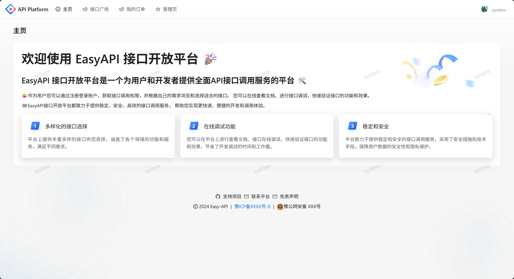
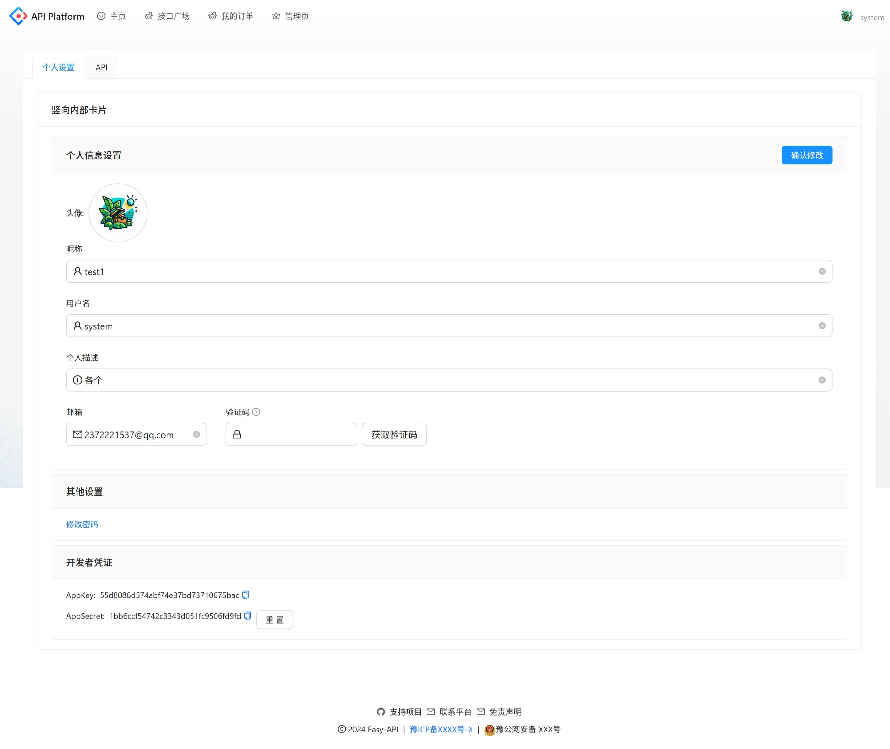
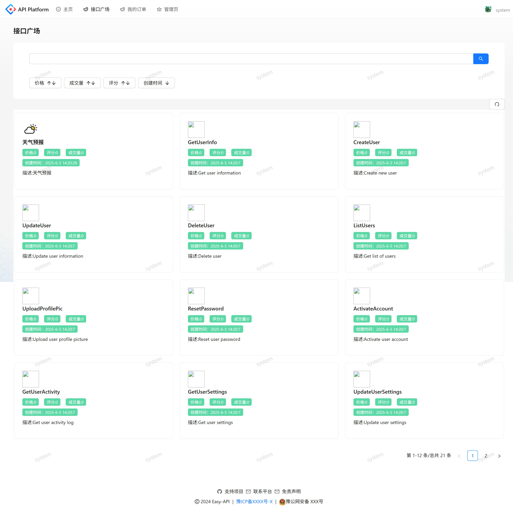
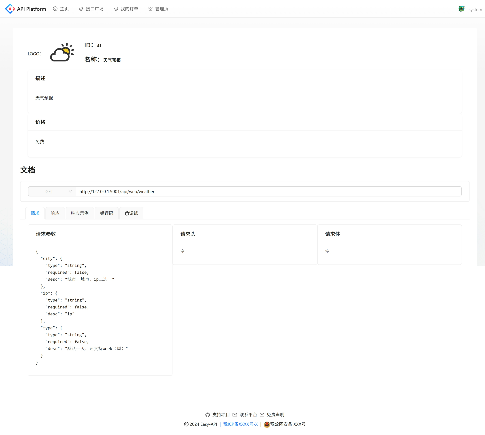
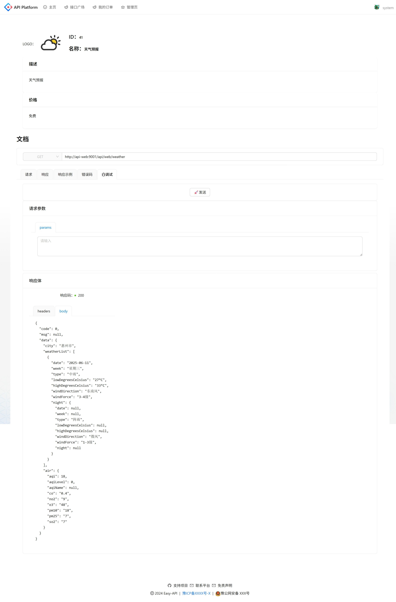

# API Open Platform

## 介绍

- API开放平台，一个API的集中管理，开发者友好的API文档的平台。

## 环境

- Java8
- Node20.10.0

## Docker

- docker compose up -d | docker compose up -d --build
- 每次gateway都因为注册会挂掉，因此需要docker compose restart gateway

- debug其中一个服务
  - 设置环境变量`JVM_ARGS=-agentlib:jdwp=transport=dt_socket,server=y,suspend=n,address=*:5005`

## 界面

